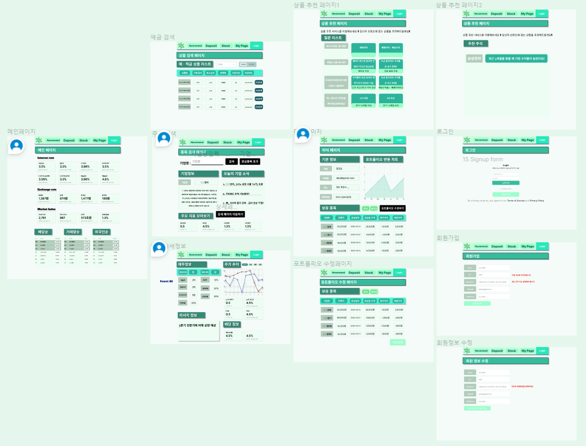
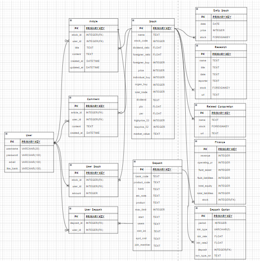
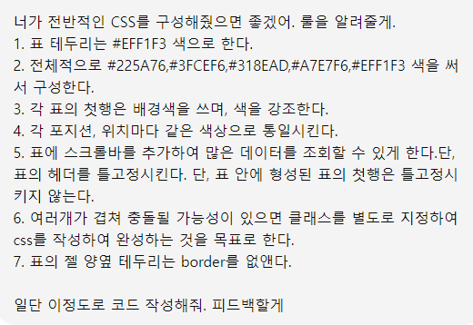
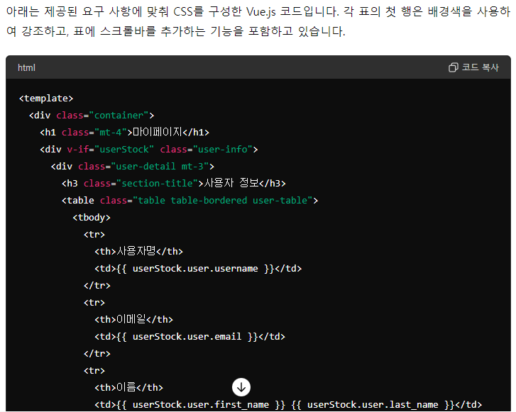
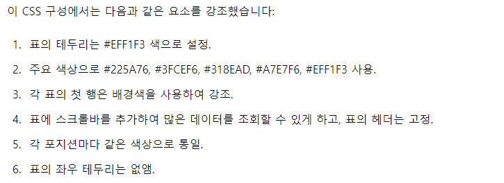

# Finance_Project : Finance Balance Investment's
> 금융과 투자의 균형을 맞추다.

## 📜 회의록 및 진행사항 

### 📕 5.16. 회의록록

#### 1. 주제 : 주식 정보 제공 및 데이터 시각화
> 관심있는 기업 선정 및 오늘의 기업 소식 공시
  - 1. 관심있는 기업을 담는다. (클릭하면 pinia에 관심있는 기업 리스트에 담는다.)
    - 백엔드로 axios 요청을 보낸다. 그래서 find_corp_code 메서드를 실행해서 종목코드로 변환해서 객체를 반환한다.
    - 관심있는 기업 리스트의 종목갯수 제한 : 10개 정도
  - 2. 관심있는 기업들의 현재 근황을 매일 새로운 소식을 전해준다.(OpenDart의 list에서 오늘 일자 반환)
  - 3. 관심있는 기업들의 기본 정보를 같이 보여준다.(재무상태표, 손익계산서, 지분공시)
  - 4. 로그인하면 관심있는 기업 저장 버튼 활성화 및 접근 가능
  - (참고문헌 : https://github.com/FinanceData/OpenDartReader/blob/master/README.md)

> 모의 시뮬레이션 기능 제공
  - 1. 관심있는 기업에 버튼 중에 시뮬레이션 버튼을 누른다.
  - 2. 버튼을 누를 때 날짜의 정보를 저장하고, axios를 통해 주가를 끌어 온다.
  - 3. 누른 시점부터 오늘 날짜까지 for문을 통해 주가정보 리스트에 저장한다.
  - 4. 저장된 주가정보를 바탕으로 라인 차트를 그려주며, 현 시점 손익을 계산해준다. (세금 빼고)

> 메인페이지에 배당순위, 시장가치 순위, 재무비율 순위 등 다양한 순위 차트를 제공한다.(한국투자증권 API 이용)

> 검색 알고리즘 (배당주, 떡상 주식, 저PER, 저PBR)
  - 떡상은 Event가 있었을 때
  - 찜한 날짜 기준으로 수익성 분석
  - 배당주는 매년 배당율이 줄어드는지 여부에 따라 차트 분석 (일정 배당율 이상이면 "배당주" 마크 부여) 

#### 2. 향후 검토
1. 실시간 시세로 모의투자가능여부(한국투자증권 API의 국내주식 실시간 체결가)
2. 현재 가격 뽑기는 네이버 금융 API가 더 편하므로 그 외의 것은 한국투자증권 API 이용
3. 현금 배당순위 API 검토(OpenDart 블로그, 한국 예탁결제원 공공데이터 API, 한투는 제외(배당률이 액면가 기준임)

---
### 🏫 5.17. 회의록
#### 1. 화면 및 DB 구성안
1. 메인페이지
  - 상단정보 : `한국은행 100대 통계지표`에서 금리, 환율, 지수 들고오기
  - 하단정보 : Stock Table에서 배당, 거래량 순으로 순위 차트 만들기
2. 마이페이지
  - 기본정보 : 사용자 개인정보(사는 곳,이름, 이메일 등)
  - 포트폴리오 변경차트 : Asset Table에서 일자를 기준으로 가격의 변동폭을 차트로 생성
  - 보유 포트폴리오 명세 : 주식, 예적금 버튼을 클릭하여 자신이 보유한 종목, 상품의 명세를 보여줌 
3. 주식검색 및 검색결과(간단정보 및 강조하고픈 정보)
  - 기업정보 : 잘 변동하지 않는 기업 정보 저장(관심등록 버튼 추가)
  - 오늘의 기업소식 : 네이버 검색 API를 통해 각 기사의 제목 따오기(최신순) => 링크 연결
  - 강조하고 싶은 지수 : 다른 주식 어플과의 차이점을 위해 간단하게 사용자들이 볼 수 있는 정보 요약
    - 예시) 가격 변동성 지수, 재무건전성 지표, 주식 배당수익률,        
4. 예금검색 : 은행명에 따라 검색하며, 기본금리와 최고금리 중 하나 선택하여 정렬
  - 예적금 상품 검색 리스트에 `상품명`, `기본금리`,`최고금리`,`은행명`,`가입기간`,`가입한도` 필드를 형성하고, 
5. 로그인 : 기능을 구현한다.
6. 주식 상세정보
  - 3개년도 재무제표 : OpenDart의 finstate에서 끌고 오기
  - 주가 변동 추이 차트 : 다음에서 이미지 형태로 끌고오기
  - 리서치 정보 : 네이버 금융 API를 통해 리서치 제목 끌고 오기
7. 기업소식 content: 네이버 검색 API를 통해 제목과 description 넣기
8. 상품추천 : 예적금 상품과 주식 상품의 수익률을 비교하기 위해 각각 하나의 상품을 추천

#### 2. 변경사항
> 9일이라는 짧은 프로젝트 기간으로, 일부 기능 재편(모의 투자시뮬레이션 -> 상품 추천)
> 수행목표를 단계별로 쪼개어, 업데이트 방식으로 프로젝트 진행

#### 3. 향후 검토
1. ERD 완성
2. 모든 API 정상 작동 여부 확인
3. API 데이터를 각 DB에 저장하는 연습하기
4. 피그마 정리하기

---
### 🖥️ 5.17 ERD 정리 완료

#### User 테이블
| 필드명     | 설명        |
|------------|-------------|
| username   | 유저명      |
| password   | 비밀번호    |
| email      | 이메일      |
| like_bank  | 선호은행    |

#### Stock 테이블
> 본 테이블은 해당 주식의 모든 정보를 담은 테이블임

| 필드명            | 설명                 |
|-------------------|----------------------|
| name              | 주식명               |
| stock_code        | 주식코드             |
| dividend_ratio    | 배당수익률           |
| foreigner_ratio   | 외국인 소진율        |
| foreigner_buy     | 외국인 순매수        |
| price             | 전일 종가            |
| individual_buy    | 개인 순매수          |
| organ_buy         | 기관 순매수          |
| total_trade       | 거래량               |
| research          | 리서치 글            |
| related_cor       | 연관된 기업          |
| pbr               | PBR                  |
| per               | PER                  |
| highprice_52      | 52주 최고가          |
| lowprice_52       | 52주 최저가          |
| market_value      | 시가총액             |

#### Daily_Stock 테이블
> 본 테이블은 매칭되는 주식의 1년치 차트를 그리기 위해, 날짜별로 주가 데이터를 모음

| 필드명  | 설명                   |
|---------|------------------------|
| date    | 해당 날짜              |
| stock   | Stock 테이블의 외래키  |
| price   | 해당 날짜의 주가       |

#### Research 테이블
> 본 테이블은 해당 주식의 리서치 글을 불러오기 위한 테이블임

| 필드명   | 설명                     |
|----------|--------------------------|
| name     | 주식 이름                |
| title    | 리서치 제목              |
| date     | 리서치 쓴 날짜           |
| reporter | 리서치를 쓴 증권사명     |
| stock    | Stock 테이블의 외래키    |

#### Related_Coporation 테이블
> 본 테이블은 본 주식과 연관된 주식을 넣기 위함

| 필드명   | 설명                        |
|----------|-----------------------------|
| name     | 연관 주식                   |
| stock    | Stock 테이블의 외래키       |
| url      | 연관 주식의 URL             |

#### Finance 테이블
> 본 테이블은 본 주식과 연관된 주식을 넣기 위함

| 필드명           | 설명                        |
|------------------|-----------------------------|
| revenuse         | 매출액                      |
| operating_pr     | 영업이익                    |
| operating_ex     | 영업비용                    |
| fluid_asset      | 유동자산                    |
| fluid_liabilites | 유동부채                    |
| total_equity     | 자본총계                    |
| total_liabilites | 부채총계                    |
| stock            | Stock 테이블의 외래키       |

#### User_Stock(다대다) 
> 본 테이블은 User가 소유한 주식들을 나타내기 위함(정보는 다 있고, 수량만 존재. 수량은 유저가 입력)

#### Deposit
> 본 테이블은 예적금의 상품을 저장하기 위한 테이블임

| 필드명     | 설명           |
|------------|----------------|
| bank_code  | 금융회사 코드  |
| bank       | 은행명         |
| etc_note   | 상품 기타 조건 |
| product    | 상품명         |
| max_limit  | 가입 한도      |
| start      | 상품 공시 날짜 |

#### Deposit_Option
> 본 테이블은 각 예적금 상품의 기간, 단복리 유형마다 이자율을 저장하기 위한 테이블

| 필드명      | 설명                        |
|-------------|-----------------------------|
| period      | 상품 기간                   |
| intr_type   | 단리 / 복리                 |
| intr_rate   | 기본 금리                   |
| intr_rate2  | 최고 금리                   |
| deposit     | Deposit 테이블의 외래키     |

#### User_Deposit(다대다)
> 본 테이블은 User가 소유한 예적금들을 나타내기 위함

---
---
## 📒 프로젝트 기획명세

### 📘 App 생성 목표
1. 사용자들이 직접적으로 쉽게 `은행`의 예적금 상품과 `주식`의 수익률을 비교할 수 있는 경험을 제공
   - 공통점 

   | 필드명 | 설명 |
   |--------|------|
   |  주식  | 배당이익, 매매차익 + 배당이익, 매매차익 중 선택하여 수익률이 높은 순으로 상품을 정렬하여 추천한다. |
   |  예금  | 이자율이 높은 순으로 상품을 정렬하여 추천하며, 은행 / 기본금리 / 최고금리를 기준으로 순위를 기록한다. |

   - (1단계 목표) 주식의 수익률과 예금의 수익률을 `1년 기준`으로 단순 비교하여 `높은 순위`의 상품 또는 종목 추천 

   | 필드명 | 설명 |
   |--------|------|
   |  주식  | 기간을 1년을 기준으로 상품을 정렬하여 수익률을 창출한다. |
   |  예금  | 주어진 연 이자율을 기준으로 상품을 정렬하여 수익률을 창출한다. |

   - (2단계 목표) 실제금액에서 수익률을 곱하여 더 `높은 순위`을 기록한 상품을 추천

   | 필드명 | 설명        |
   |--------|-------------|
   | 주식   | 투입금액의 수익률을 곱하여 더 높은 순위를 기록한 상품을 추천 |
   | 예금   | 투입금액을 단리 / 복리 유형과 기간에 따라 실제 이자금액을 계산하여 비교 |

   - (3단계 목표) 포트폴리오 페이지에 주식과 예금 상품을 넣어서, 포트폴리오의 자산 그래프를 그린다.

   | 필드명 | 설명        |
   |--------|-------------|
   | 주식   | 투입금액의 수익률을 곱하여 더 높은 순위를 기록한 상품을 추천 |
   | 예금   | 투입금액을 단리 / 복리 유형과 기간에 따라 실제 이자금액을 계산하여 비교 |

---
### 🎖️ 페이지별 수행목표

1. 공통 
  - 네비게이션 바 : 예적금, 주식, 마이페이지로 갈 수 있는 아이콘을 만든다.

2. 메인페이지 
  - (통계지표)
    - 한국은행 API의 `100대 통계지표`를 매일마다 들고와서 갱신한다.
    - `watch`를 써서 등록된 일자가 오늘일자와 다를 때만 `axios`를 사용한다. 
  - (배당, 거래량, 시가총액 순 차트)
    - `Stock` 테이블에 저장되어 있는 주식들을 필터링하여 순위 리스트를 제공한다.
    - 클릭하면 해당 `주식정보 페이지`로 이동한다.

3. 예금검색 페이지
  - 은행명, 기본금리 / 최고금리 기준으로 필터링할 수 있게 한다.
  - 상품명 / 기본금리 / 최고금리 / 가입기간 / 최대한도를 기준으로 리스트를 정렬한다.
  - 관심등록 버튼을 누르면 해당 페이지로 이동한다.(유저가 보유중인 상품에 추가한다.)

4. 종목검색 페이지
  - 기업명을 검색하면 Stock 테이블에서 모든 데이터를 끌고 온다.
  - RouterView를 사용하여 간단한 정보는 그 페이지에서 볼 수 있게 한다.
  - (도전)`주요 지표 모아보기` : 기존 주식에 없던 지표를 만들어서 제공한다. 
    - (예시) 가격변동성 지수(`1년간 표준편차`), 재무건전성(`유동비율`)

5. 종목상세 페이지
  - 3개년 재무정보를 끌고 온다. (금융감독원의 OpenDart API 이용)
    - 직전연도의 사업보고서를 기준으로 검색한다.
    - `매출액`,`영업이익`,`당기순이익`,`영업비용`,`유동비율`,`ROE`,`부채비율`을 들고온다. 
      - 부채비율 : 부채총계 / 자본총계 
      - ROE : 당기순이익 / 자본총계 
      - 유동비율 : 유동자산 / 유동부채
  - 최근 1년 주가정보를 끌고온다 (금융감독원의 OpenDart API 이용)
    - Daily_Stock에 있는 주가정보를 차트로 변환하여 들고온다.
  - 리서치 정보
    - 네이버금융 API에 있는 리서치 테이블의 제목을 넣고, 클릭 시, 링크가 연결되게 한다.

6. 기업소식 페이지
  - 네이버 검색 API를 통해 해당 주식명을 네이버에서 검색한 후 최신순으로 10개를 가져온다.

7. 마이페이지
  - 유저의 기본정보를 적고, 정보수정 버튼을 만든다.
  - (도전) 
    - 포트폴리오에 담긴 자산들의 일일 데이터를 차트로 구성한다.
    - 자신이 보유한 종목의 리스트를 예금, 적금 중 선택하여 보여주고, 포트폴리오 수정하기 버튼을 클릭하여 보유 중인 포트폴리오를 수정한다.

8. 포트폴리오 수정 페이지
  - 보유하고 있는 종목의 `수량`과 보유 `시점`을 수정할 수 있다.

9. 로그인
  - `dj_rest_auth`를 통해 구현한다.
  - 로그인 후, token을 local에 저장한다.
  - 로그인 시, 로그인된 정보를 프론트에 쏴준다.(Serializer에 포함시킨다.)

10. 회원가입
  - `dj_rest_auth`를 통해 구현한다.
  - 회원가입하면 자동 로그인이 되게 한다.

11. 로그아웃
  - 로그인이 되었을 때에만 보여지게 하며, 반대의 경우에는 로그인만 보이게 한다.

12. 회원정보 수정
  - 마이페이지에서 회원정보 수정버튼을 눌렀을 때, 회원정보 수정 페이지로 넘어온다.
  - `beforeEnter`를 써서 로그인이 되지 않으면 오지 못하게 한다.

---
---
## 📖 최종 프로젝트 수행 결과

### 📓 실행환경
1. 백엔드

| 실행환경 | 버전 |
|---------|------| 
| asgiref | 3.8.1 |
| beautifulsoup4 | 4.12.3 | 
| certifi | 2024.2.2 |
| charset-normalizer | 3.3.2 | 
| colorama | 0.4.6 | 
| contourpy | 1.2.1 |
| cycler | 0.12.1 |
| dj-rest-auth | 6.0.0 |
| Django | 4.2.9 |
| django-allauth | 0.63.1 | 
| django-cors-headers | 4.3.1 | 
| django-environ | 0.11.2 |
| djangorestframework | 3.15.1 |
| finance-datareader | 0.9.90 |
| fonttools | 4.51.0 | 
| idna | 3.7 |
| kiwisolver | 1.4.5 | 
| lxml | 5.2.2 |
| matplotlib | 3.9.0 |
| numpy | 1.26.4 | 
| OpenDartReader | 0.2.3 |
| packaging | 24.0 |
| pandas | 2.2.2 |
| pillow | 10.3.0 |
| plotly | 5.22.0 |
| pyparsing | 3.1.2 |
| python | 3.9.13 | 
| python-dateutil | 2.9.0.post0 |
| pytz | 2024.1 |
| requests | 2.31.0 |
| requests-file | 2.0.0 |
| seaborn | 0.13.2 |
| six | 1.16.0 |
| soupsieve | 2.5 |
| sqlparse | 0.5.0 |
| tenacity | 8.3.0 |
| tqdm | 4.66.4 | 
| tzdata | 2024.1 |
| urllib3 | 2.2.1 |

2. 프론트엔드

| 실행환경 | 버전 |
|---------|------| 
| axios | 1.6.8 |
| bootstrap | 5.3.3 |
| bootstrap-icons | 1.11.3 |
| pinia | 2.1.7 |
| pinia-plugin-persistedstate | 3.2.1 |
| sass | 1.77.1 | 
| vue | 3.4.21 |
| vue-router | 4.3.0 | 

---
### 📰 페이지별 수행목표 달성 여부 및 기능 요약

|  페이지명  | 공통 및 속성              | 달성여부 |
|------------|---------------------------|----------|
| 메인페이지 | 통계지표 및 차트 구현완료 | 달성완료 |
| 예금검색   | 은행 검색, 관심등록(해제) 버튼 추가 | 달성완료 |
| 종목검색   | 주식 데이터 가져오기 | 달성완료 |
| 종목상세   | 기본페이지와 통합    | 달성완료 |  
| 기업소식   | 네이버 검색 API 이용 | 달성완료 |
| 마이페이지 | 관심종목 및 상품 들고오기 | 달성완료 |
| 포트폴리오 수정페이지 | 수행 못함 | 미완료 | 
| 회원가입   | 회원가입 가능 | 달성완료 | 
| 로그아웃   | 로그아웃 가능 | 달성완료 | 
| 회원정보 수정 | 비밀번호 외 변경가능 | 일부 완료 |   

---
### 🌈 초창기 기획의도

1. 목표 : 사회초년생, 금융 상품에 대해 잘 모르는 직장인들을 대상으로 만들었으며, 주식과 예적금을 한눈에 비교할 수 있게 검색 및 비교 서비스를 제공 
2. 주요기능 : 모의 투자 시뮬레이션 및 주식 / 예적금 상품 비교할 수 있게 해주기 

---
### 🕐 일자별 진행사항

| 일자 | 진행사항 |
|------|----------|
| 5.16 | 프로젝트 기획회의 및 기획명세 작성 | 
| 5.17 ~ 5.18 | 주식, 예적금 DB 생성(API 이용) 및 로그인 기능 구현 |
| 5.19 | 목표 축소 -> 모의투자 시뮬레이션을 제거하고, 포트폴리오 기능 축약하여 관심종목을 마이페이지에서 볼수 있게 변경 |
| 5.20 | 메인페이지 구현(네비게이션 바, 환율계산기) | 
| 5.21 | 예적금 검색 페이지 및 마이페이지 구현 |
| 5.22 | 주식 검색페이지 및 상품추천 페이지 완료 |
| 5.23 | CSS 및 각종 기능 점검 |

---
### 🚀 팀원 업무 분담
1. 이창호 : 팀장으로써 프로젝트 기획 및 백엔드 파트 전담
  - Model 및 serializer 작성
  - 오픈 API를 통해 가용 데이터 수집 및 전처리 
  - 주식, 예적금 데이터 DB 생성
  - Vue로 데이터를 보낼 API 생성 
  - ERD 및 프로젝트 기획 명세 작성(피그마 생성)
  - 페이지의 CSS 작성 

2. 박동현 : 팀원으로써 프론트 파트 전담
  - 프론트엔드 파트 전담
  - 각종 페이지 구성(메인, 검색 등)
  - Vue와 Django를 연결하여 비동기식 버튼, 기능 구현  
  - 회원가입, 로그인 기능 구현

---
### 📈 ERD 

> 주요 변경사항 : DateField에서 일부 TEXT로 변경(데이터 수집 과정에서 에러 발생)

---
### 🗂️ 프로젝트 실행 절차 및 방법
1. Django
  1. 가상환경 생성 : `python -m venv venv`
  2. 가상환경 활성화 : `source venv/Scripts/activate/`
  3. env 파일 생성하여 API 키 들고오기
  3. 필요한 라이브러리 설치 : `pip install -r requirements.txt`
    (상세명세는 위에 참고)
  4. 데이터베이스 설계도 생성 : `python manage.py makemigrations`
  5. 데이터베이스 생성 : `python manage.py migrate`
  6. 데이터 가져오기 : `python manage.py loaddata`
  7. 백엔드 서버 실행 : `python run server`

2. Vue
  1. 필수 라이브러리 설치 : `npm install`
  2. 프론트 서버 실행 : `npm run dev`

### 🖋️ 페이지 주요 기능 구현

1. 메인페이지 
  - 각종 페이지로 이동하는 네비게이션 바 작성 완료
  - 배당순, 시가총액 순 주식차트 구현
  - 금리, 환율 등 시장지표 Carousel을 통해 구현 

2. 예적금페이지
  - 각 은행 선택 시, 해당하는 은행의 예적금 상품 공개
  - 은행 클릭 시, 은행 상세정보 popover
  - 관심 상품 등록 시, 마이페이지에 추가

3. 주식페이지
  - 주식상품 검색 시, 주식종목이 아래에 띄워짐
  - 관련기업을 누를 경우 관련기업 주식페이지로 이동
  - 리서치, 관련 뉴스를 누르면 해당 페이지로 이동
  - 주식의 기본정보, 재무정보, 주가차트 제공

4. 추천페이지
  - 예적금과 주식상품 중 1개씩 추천
  - 각 수익률을 기준으로 버튼 클릭시 하단에 2개의 카드 생성
  - 카드 누를 경우, 해당페이지로 이동

### 📔 금융 상품 추천 알고리즘에 대한 기술적 설명

1. 예적금에서 단리 / 복리, 예금 / 적금, 단기 / 장기에 따라서 최고의 수익률을 가진 상품을 가져옵니다.
2. 그 6개 중에서도 최고의 수익률을 가져온 데이터를 뽑아옵니다.
3. 주식은 선택한 기준에 따라 수익률을 창출합니다.(매매차익, 매매차익 + 배당수익률, 변동성)
4. 각종 재무지표를 통과시킵니다. 부채비율, 유동비율, 영업이익 등
5. 그 중 최고의 수익률을 가진 10개의 데이터 중에 하나를 랜덤으로 뽑아서 제시합니다.

### 🔍 AI 활용여부
> 당초계획 : ChatGPT를 이용하여 주식 페이지에 기업검색을 추가하려고 했으나, 시간이 부족하여 녹여내지 못함
> 대신 ChatGPT에 프롬프트를 입력하여 전체적인 페이지의 레이아웃 및 CSS를 구성하는데 적극적으로 활용 
요청

요청결과
 / 

### 📝 프로젝트 후기
#### 힘든 점
1. 데이터 전처리
  - 오픈 API를 호출하는 것은 비교적 용이하게 할 수 있었으나, 수집된 데이터를 DB에 저장시키는 과정 중에 아래와 같은 많은 오류 발생 (약 180,000개 데이터)  
     1. try ~ except를 써서 DB에 저장할 때 발생하는 오류를 일부 제거했으나, 결측치가 있는 데이터 이후 저장되지 않는 경우 발생
     2. DateField의 양식에 맞게 저장하는 것이 쉽지 않았음
     3. 모든 데이터를 일일이 확인할 수 없어 하나씩 오류를 보고 개선
  - 데이터를 한꺼번에 저장했을 때, 모델이 바뀌면 다시 전부 제거하고 다시 dump해야하는 경우가 있기에 많은 시간이 소요됨
  - 데이터가 오류없이 저장되었을 때, 실제 데이터를 봐야 이상하게 저장된 것을 확인할 수 있는 경우도 존재

2. store 문제
  - 병합할 때, store의 기존 변수명을 바꾸고, 파일을 생성하여 에러를 발견하지 못하여 이전 커밋으로 되돌아가는 사건 발생 
  - 심지어 직전 commit이 5~6시간 전이라 그동안 작업한 내역 날라감

#### 느낀점
1. 프로젝트를 하면서 `현실적인 조건`에 따라 목표치가 많이 변동되니, 프로젝트 기획을 세부적으로 하는 것이 중요함을 느낌
2. Model 뿐만 아니라, 개발일정, 상세페이지별 명세, 공통으로 쓰는 전역변수 명까지 전부다 지정해주는 게 좋을 것 같았고, 변경되는 즉시 팀원들에게 알리는 것이 중요함을 느낌
3. 백엔드는 가장 오래 걸리는 작업이 데이터 전처리임을 확실하게 느낌. 데이터를 수집하는 과정에서 어떤 형태의 데이터인지 모르는 경우가 많아 오류없이 저장한다해도 구현한 뒤에야 발견되는 경우가 많이 발생.
4. 팀원간의 의사소통이 굉장히 중요함. 우리의 경우 사정상 비대면으로 소통을 하는 경우가 많아 병합 문제가 꽤 발생함. 
